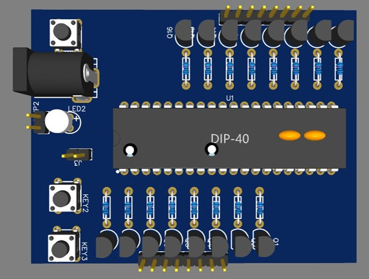

# LED MATRIX 8X8

8X8 LED MATRIX, based on 8051 MCU.

## Introduction

This is a project for CE103.

<!-- * `/pcb/`: Schematic and PCB, built with Altium Designer -->
* `/simulation/`: Circuit simulation with Proteus
* `/src/`: Source code of the LED MATRIX 8X8 firmware

## Members
| ID |        Full Name |                                         |                  Email |
| --- | :------: | ----------------------------------------------: | ---------------------: |
| 21521661   | Huỳnh Ngọc Quỳnh Uyên |   | 21521661@gm.uit.edu.vn |
| 22521452   | Nguyễn Ngọc Minh Thức |   | 22521452@gm.uit.edu.vn |
| 22520746   | Trần Đồng Trúc Lam |   | 22520746@gm.uit.edu.vn |

## Gallery

<!--  -->

<!-- 

 -->
